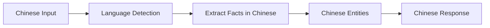

# Multilingual Support

Hindsight automatically detects the language of your input and responds in the same language. This means facts, entities, and reflections are preserved in their original language without translation to English.

## How It Works



When you retain content or reflect on a query, Hindsight:

1. **Detects the input language** automatically from the content
2. **Extracts facts in the original language** - preserving nuance and meaning
3. **Stores entities in their native script** - 张伟 stays 张伟, not "Zhang Wei"
4. **Responds in the same language** - queries in Chinese get Chinese answers

---

## Retain with Non-English Content

When you retain content in any language, Hindsight extracts and stores facts in that same language.

### Example: Chinese Content

```python
from hindsight import Hindsight

hindsight = Hindsight()

# Retain Chinese content
hindsight.retain(
    bank_id="user-123",
    content="""
    张伟是一位资深软件工程师，在腾讯工作了五年。
    他专门研究分布式系统，并领导了公司微服务架构的开发。
    """,
    context="团队概述"
)

# Query in Chinese - get Chinese results
results = hindsight.recall(
    bank_id="user-123",
    query="告诉我关于张伟的信息"
)

# Facts are returned in Chinese:
# - 张伟是一位资深软件工程师，在腾讯工作了五年
# - 张伟专门研究分布式系统，并领导了公司微服务架构的开发
```

### Example: Japanese Content

```python
hindsight.retain(
    bank_id="user-123",
    content="""
    田中さんはソフトウェアエンジニアで、東京のスタートアップで働いています。
    彼女はPythonとTypeScriptが得意で、毎日コードレビューをしています。
    """,
    context="チームプロフィール"
)

# Query in Japanese
results = hindsight.recall(
    bank_id="user-123",
    query="田中さんについて教えてください"
)
```

---

## Reflect with Non-English Queries

The `reflect` operation also respects the input language, generating thoughtful responses in the same language as the query.

### Example: Chinese Reflection

```python
# Store facts about team members (in Chinese)
hindsight.retain(
    bank_id="team-eval",
    content="张伟是一位优秀的软件工程师，完成了五个重大项目。他总是按时交付，代码整洁有良好的文档。",
    context="绩效评估"
)

hindsight.retain(
    bank_id="team-eval",
    content="李明最近加入团队。他错过了第一个截止日期，代码有很多bug。",
    context="绩效评估"
)

# Reflect in Chinese
result = hindsight.reflect(
    bank_id="team-eval",
    query="谁是更可靠的工程师？"
)

# Response is in Chinese:
# "我认为张伟更可靠。张伟完成了五个重大项目，按时交付，代码质量高..."
```

---

## Mixed Language Content

Hindsight handles mixed-language content gracefully, preserving both languages where appropriate.

### Example: Chinese Text with English Company Names

```python
hindsight.retain(
    bank_id="user-123",
    content="""
    王芳在Google北京办公室工作，她是一名高级产品经理。
    之前她在Microsoft和Amazon工作过。
    她负责管理YouTube在中国市场的推广策略。
    """,
    context="员工资料"
)

# Facts preserve both languages:
# - 王芳在Google北京办公室工作，担任高级产品经理
# - 王芳曾在Microsoft和Amazon工作过
# - 王芳负责管理YouTube在中国市场的推广策略
```

---

## Supported Languages

Hindsight supports any language that your configured LLM can understand. This typically includes:

| Language | Script | Example |
|----------|--------|---------|
| Chinese (Simplified) | 简体中文 | 张伟是软件工程师 |
| Chinese (Traditional) | 繁體中文 | 張偉是軟體工程師 |
| Japanese | 日本語 | 田中さんはエンジニアです |
| Korean | 한국어 | 김철수는 개발자입니다 |
| Arabic | العربية | أحمد مهندس برمجيات |
| Russian | Русский | Иван - разработчик |
| Spanish | Español | María es ingeniera |
| French | Français | Pierre est développeur |
| German | Deutsch | Hans ist Entwickler |
| And many more... | | |

The actual language support depends on your LLM provider's capabilities.

---

## Best Practices

### 1. Keep Content in One Language Per Retain Call
While mixed content works, keeping each `retain` call in a single language produces more consistent results.

### 2. Query in the Same Language as Your Content
For best results, query using the same language as your stored content. Cross-language queries (e.g., English query for Chinese content) may work but results can vary.

### 3. Consider Embedding Model Language Support
The default embedding model (`BAAI/bge-small-en-v1.5`) is English-optimized. For better multilingual semantic search, consider using a multilingual embedding model:

```bash
# In your .env file
HINDSIGHT_API_EMBEDDINGS_LOCAL_MODEL=BAAI/bge-m3
```

The `bge-m3` model supports 100+ languages with better cross-lingual retrieval.

---

## Technical Details

Multilingual support is implemented through LLM prompt instructions rather than external language detection libraries. This approach:

- **Requires no additional dependencies**
- **Works with any LLM** that supports multiple languages
- **Handles edge cases** like mixed-language content naturally
- **Preserves semantic meaning** better than rule-based translation

The LLM is instructed to:
1. Detect the input language
2. Extract all facts, entities, and descriptions in that same language
3. Never translate to English unless the input is in English
